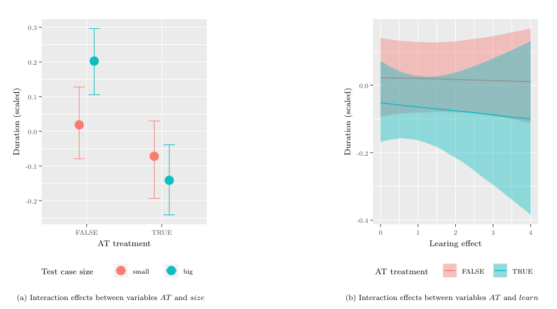

[](https://doi.org/10.5281/zenodo.8328166)

# Analysis of Data on Augmented Testing for manual GUI-based Regression Testing

Replication package for the study "Augmented Testing to support Manual GUI-based Regression Testing: An Empirical Study"

<p align="center"></p>

## Introduction

**Context:**
Manual graphical user interface (GUI) software testing presents a substantial part of the overall practiced testing efforts, despite various research efforts to further increase test automation.
Augmented Testing (AT), a novel approach for GUI testing, aims to aid manual GUI-based testing through a tool-supported approach where an intermediary visual layer is rendered between the system under test (SUT) and the tester, superimposing relevant test information.

**Objective:**
The primary objective of this study is to gather empirical evidence regarding AT's efficiency compared to manual GUI-based regression testing.
Existing studies involving testing approaches under the AT definition primarily focus on exploratory GUI testing, leaving a gap in the context of regression testing.
As a secondary objective, we investigate AT's benefits, drawbacks, and usability issues when deployed with the demonstrator tool, Scout.

**Method:**
We conducted an experiment involving 13 industry professionals, from six companies, comparing AT to manual GUI-based regression testing.
These results were complemented by interviews and Bayesian data analysis (BDA) of the study's quantitative results.

**Results:**
The results of the Bayesian data analysis revealed that the use of AT shortens test durations in 70% of the cases on average, concluding that AT is more efficient.
When comparing the means of the total duration to perform all tests, AT reduced the test duration by 36% in total.
Participant interviews highlighted nine benefits and eleven drawbacks of AT, while observations revealed four usability issues.

**Conclusion:**
This study makes an empirical contribution to understanding Augmented Testing, a promising approach to improve the efficiency of GUI-based regression testing in practice.
Furthermore, it underscores the importance of continual refinements of AT.

## Analysis

The analysis consists of two parts.

### Descriptive Statistics

In `src/main.qmd`, we performed descriptive statistics analysis of the data and visualized them using bar and violin plots.

- [Rendered HTML](https://andreas-bauer.github.io/AT-study/main.html)
- [Source code](src/main.qmd)

### Bayesian Data Analysis (BDA)

`src/BDA.qmd` contains the Bayesian Data Analysis of the data.

- [Rendered HTML](https://andreas-bauer.github.io/AT-study/BDA.html)
- [Source code](src/BDA.qmd)

## Installation

Use `setup.R` to install dependencies.

## Rendering

Use makefile to render a new version.

```sh
make render
```

## License

Copyright © 2023 Andreas Bauer, Julian Frattini

This work (source code) is licensed under  [MIT](./LICENSE).
